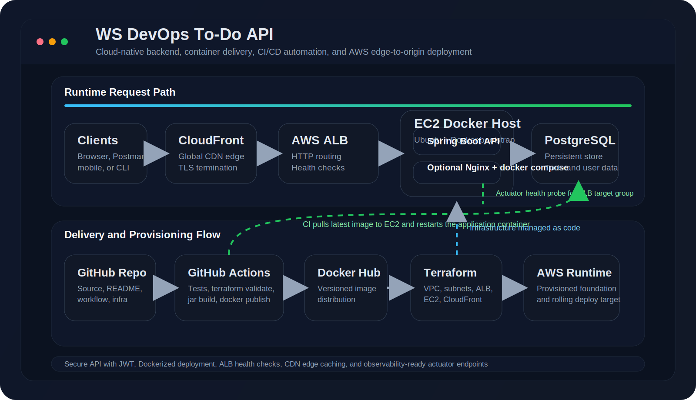
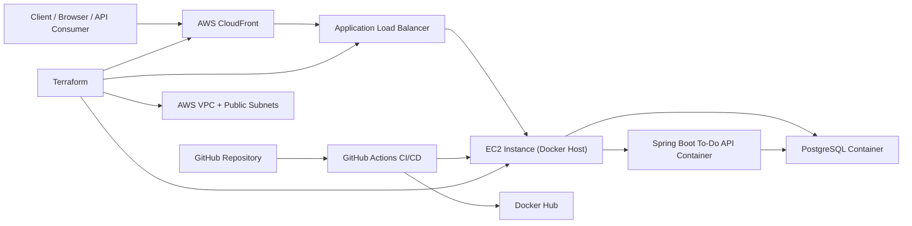
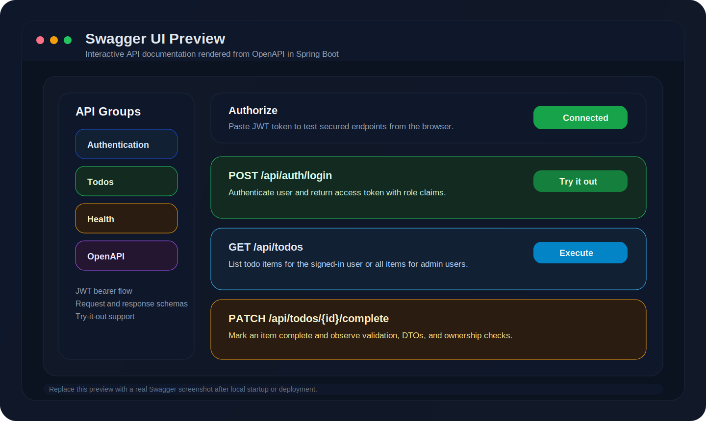
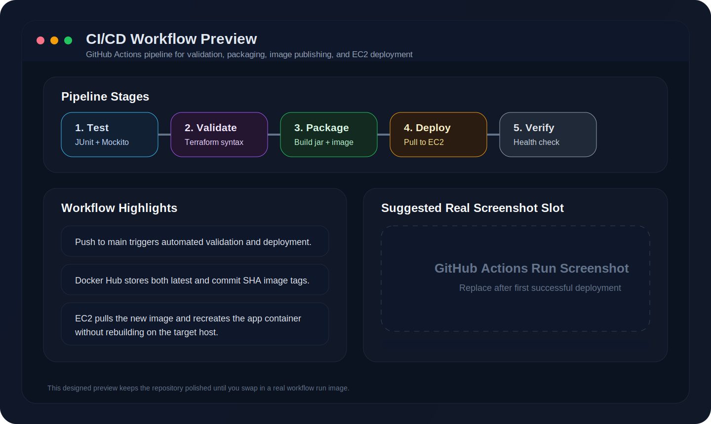

# WS DevOps To-Do API

[](https://openjdk.org/)
[](https://spring.io/projects/spring-boot)
[](https://aws.amazon.com/)
[](https://www.docker.com/)
[](https://www.terraform.io/)
[](https://github.com/features/actions)

Cloud-native To-Do REST API built to demonstrate backend engineering, DevOps automation, and AWS deployment patterns in one portfolio-ready project. The repository combines a production-style Spring Boot 3 application with Docker packaging, Terraform infrastructure, GitHub Actions CI/CD, JWT security, PostgreSQL persistence, and monitoring-ready actuator endpoints.

## Problem Statement

Many junior portfolio projects stop at local CRUD APIs and do not show how software is packaged, secured, deployed, and operated in production. This project closes that gap by demonstrating:

- Secure backend API development with authentication and authorization
- Infrastructure as Code for repeatable AWS provisioning
- Containerized delivery for local and remote environments
- CI/CD automation from GitHub to Docker Hub to EC2
- Health and metrics readiness for future observability tooling

## Features

- Java 17 + Spring Boot 3 REST API with layered architecture
- JWT authentication with BCrypt-hashed passwords
- Role-based access control with `USER` and `ADMIN`
- PostgreSQL-backed persistence with JPA and Flyway migration
- Validation, DTO mapping, and centralized exception handling
- Swagger UI and OpenAPI documentation
- Spring Boot Actuator with health, readiness, metrics, and Prometheus endpoints
- Multi-stage Docker build and `docker compose` local environment
- Terraform modules for VPC, EC2, ALB, security groups, and CloudFront
- GitHub Actions workflow for build, test, image publish, and EC2 deployment

## Architecture Diagram



<details>
<summary>Mermaid Source</summary>



</details>

## Screenshots

Designed preview cards are included so the repository still looks polished before you replace them with real captures from local runs and live CI executions.

<p align="center">
  
  
</p>

## Project Structure

```text
ws-devops-todo-api/
├── app/
├── infra/
├── .github/workflows/ci-cd.yml
├── docker-compose.yml
├── nginx.conf
├── .env.example
├── README.md
├── architecture.svg
└── .gitignore
```

## API Endpoints

| Area | Method | Endpoint | Auth Required | Description |
|------|--------|----------|---------------|-------------|
| Auth | POST | `/api/auth/register` | No | Register a new user and return JWT |
| Auth | POST | `/api/auth/login` | No | Authenticate and return JWT |
| Todo | GET | `/api/todos` | Yes | List todos for the current user, or all for admin |
| Todo | GET | `/api/todos/{id}` | Yes | Get a specific todo |
| Todo | POST | `/api/todos` | Yes | Create a new todo |
| Todo | PUT | `/api/todos/{id}` | Yes | Replace a todo |
| Todo | DELETE | `/api/todos/{id}` | Yes | Delete a todo |
| Todo | PATCH | `/api/todos/{id}/complete` | Yes | Mark a todo as complete |
| Health | GET | `/actuator/health` | No | Basic liveness endpoint |
| Docs | GET | `/swagger-ui.html` | No | Interactive API documentation |

## Technology Stack

- Backend: Java 17, Spring Boot 3, Spring Security, Spring Data JPA
- Persistence: PostgreSQL, Flyway
- Testing: JUnit 5, Mockito, Spring Boot Test, H2 for isolated test runs
- Containerization: Docker, Docker Compose, optional Nginx reverse proxy
- Cloud: AWS EC2, VPC, ALB, CloudFront
- IaC / Delivery: Terraform, GitHub Actions, Docker Hub

## Local Setup

### Prerequisites

- Java 17+
- Maven 3.9+
- PostgreSQL 16+ or Docker

### Run with Maven

1. Copy the example environment file:

   ```bash
   cp .env.example .env
   ```

2. Export the required variables or place them in your shell profile:

   ```bash
   export SPRING_DATASOURCE_URL=jdbc:postgresql://localhost:5432/todo_db
   export SPRING_DATASOURCE_USERNAME=todo_user
   export SPRING_DATASOURCE_PASSWORD=todo_password
   export JWT_SECRET=your-base64-encoded-secret
   ```

3. Start the application:

   ```bash
   cd app
   mvn spring-boot:run
   ```

4. Access the app:

- API Base URL: `http://localhost:8080`
- Swagger UI: `http://localhost:8080/swagger-ui.html`
- Health: `http://localhost:8080/actuator/health`

## Docker Setup

Run the full stack locally:

```bash
cp .env.example .env
docker compose up --build
```

Services:

- Spring Boot API on `http://localhost:8080`
- PostgreSQL on `localhost:5432`

To stop:

```bash
docker compose down
```

## Terraform Deployment Steps

1. Move into the infrastructure directory:

   ```bash
   cd infra
   ```

2. Copy and edit the example variables file:

   ```bash
   cp terraform.tfvars.example terraform.tfvars
   ```

3. Initialize and validate:

   ```bash
   terraform init
   terraform validate
   terraform fmt
   ```

4. Provision AWS resources:

   ```bash
   terraform apply
   ```

5. After apply, Terraform outputs:

- EC2 public IP
- ALB DNS name
- CloudFront URL

Notes:

- Two public subnets are created so the ALB can span multiple Availability Zones.
- EC2 bootstraps Docker automatically through `user_data`.
- The host writes `/opt/ws-devops-todo-api/.env` for use by both bootstrap and CI/CD deploys.

## GitHub Actions CI/CD Flow

On every push to `main`, the pipeline:

1. Checks out the repository
2. Sets up Java 17
3. Configures AWS credentials
4. Validates Terraform syntax
5. Runs automated tests
6. Builds the Spring Boot JAR
7. Builds the Docker image
8. Logs in to Docker Hub
9. Pushes the image with `latest` and commit SHA tags
10. Connects to EC2 over SSH
11. Pulls the latest image
12. Restarts the application container without rebuilding on the server

### Required GitHub Secrets

- `AWS_ACCESS_KEY_ID`
- `AWS_SECRET_ACCESS_KEY`
- `DOCKER_USERNAME`
- `DOCKER_PASSWORD`
- `EC2_HOST`
- `EC2_USER`
- `EC2_SSH_KEY`

## Security Features

- BCrypt password hashing for user credentials
- JWT bearer authentication
- Role-based authorization for `USER` and `ADMIN`
- Ownership checks so standard users can access only their own todos
- Stateless API sessions suitable for containerized deployments
- Centralized exception handling to avoid leaking internal errors
- AWS security groups for least-privilege network access

## Monitoring Ready

The application exposes actuator endpoints suitable for future observability integration:

- `/actuator/health`
- `/actuator/health/readiness`
- `/actuator/metrics`
- `/actuator/prometheus`

To extend this into a full observability stack later, add:

- Prometheus for scraping `/actuator/prometheus`
- Grafana dashboards for JVM, HTTP, and database metrics
- CloudWatch alarms for EC2, ALB, and application health events
- Centralized logging with CloudWatch Logs, Loki, or OpenSearch

## Sample Requests

Register a user:

```bash
curl -X POST http://localhost:8080/api/auth/register \
  -H "Content-Type: application/json" \
  -d '{
    "name": "Jane Doe",
    "email": "jane@example.com",
    "password": "Password123"
  }'
```

Create a todo:

```bash
curl -X POST http://localhost:8080/api/todos \
  -H "Authorization: Bearer <JWT_TOKEN>" \
  -H "Content-Type: application/json" \
  -d '{
    "title": "Prepare ALB health checks",
    "description": "Validate readiness endpoint in production",
    "priority": "HIGH",
    "dueDate": "2026-12-31"
  }'
```

## Future Improvements

- Add refresh tokens and token revocation
- Introduce Redis-backed caching and rate limiting
- Add RDS, Secrets Manager, and SSM Parameter Store for stronger production hardening
- Replace single-host PostgreSQL container with managed database infrastructure
- Add blue/green or rolling deployments
- Add Prometheus, Grafana, and CloudWatch log shipping
- Add a frontend dashboard in React or Thymeleaf

## Resume Highlights

- Built a production-style Java 17 / Spring Boot API with JWT auth, Flyway migrations, and layered architecture
- Containerized the application with a multi-stage Docker build and local Compose orchestration
- Automated CI/CD with GitHub Actions, Docker Hub image publishing, and EC2 remote deployments
- Provisioned AWS networking and delivery infrastructure using Terraform across VPC, EC2, ALB, and CloudFront
- Designed the project to showcase backend, DevOps, SRE, and cloud engineering skills in one repository

## License

This project is released under the MIT License. See [LICENSE](./LICENSE).
